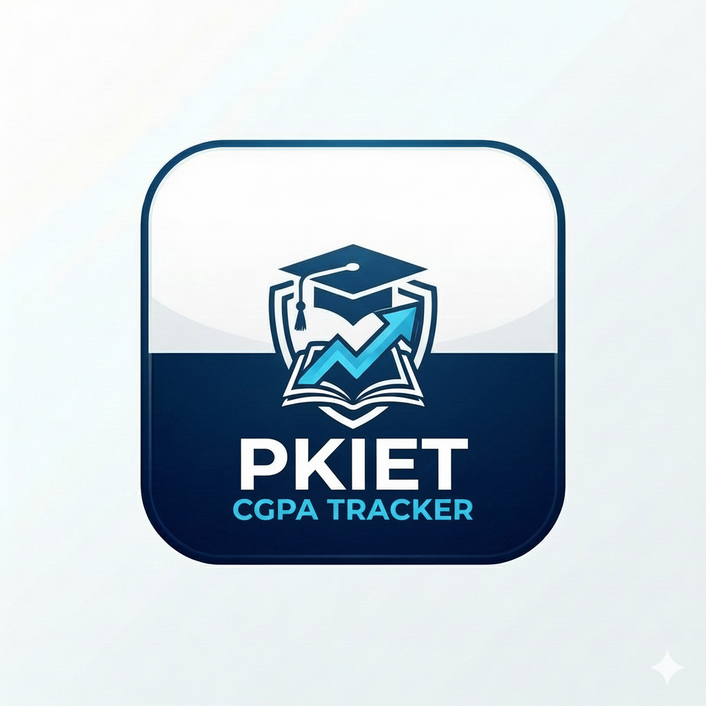

# PKIET CGPA Tracker 🚀

A professional and feature-rich CGPA tracking application for PKIET students, built with React Native and Expo. This application provides a seamless experience for calculating, monitoring, and managing academic performance with a focus on privacy and user experience.



## ✨ Features

- **Smart CGPA Calculation**: Fast and accurate algorithms tailored for university standards.
- **Department-Specific Logic**: Support for CSE, IT, EEE, and more with centralized department data.
- **Custom Subjects**: Add your own subjects, credits, and grades for flexible tracking.
- **Academic Progress Charts**: Visualize your performance over semesters with dynamic SVG-based charts.
- **Privacy-First (Realm DB)**: All your data is stored securely and locally on your device using Realm NoSQL database. No cloud uploads required.
- **Export to PDF**: Generate professional academic reports for your records.
- **Offline First**: Works perfectly without an active internet connection.
- **Premium UI/UX**: Dark mode support, glassmorphism designs, and smooth animations.

## 🛠️ Tech Stack

- **Framework**: [React Native](https://reactnative.dev/) with [Expo](https://expo.dev/)
- **Database**: [Realm NoSQL](https://realm.io/)
- **State Management**: React Hooks (useState, useEffect, useMemo, useCallback)
- **Navigation**: [React Navigation 7](https://reactnavigation.org/)
- **Styling**: Vanilla CSS-like StyleSheet with Linear Gradients
- **Icons**: Expo Vector Icons (Ionicons, MaterialIcons)
- **Visuals**: React Native SVG for progress analysis

## 🚀 Getting Started

### Prerequisites

- [Node.js](https://nodejs.org/) (v20 or later recommended)
- [npm](https://www.npmjs.com/) or [yarn](https://yarnpkg.com/)
- [Expo Go](https://expo.dev/expo-go) app on your mobile device (for development)

### Installation

1. Clone the repository:
   ```bash
   git clone https://github.com/dhnaush0745/cgpatracker.git
   ```

2. Navigate to the project directory:
   ```bash
   cd cgpatracker
   ```

3. Install dependencies:
   ```bash
   npm install
   ```

4. Start the development server:
   ```bash
   npx expo start -c
   ```

5. Scan the QR code using the Expo Go app on your phone.

## 👥 Meet the Team (Hexonyx)

We are a team of dedicated developers committed to building innovative solutions for students.

| Name | Role | Profiles |
| :--- | :--- | :--- |
| **Dhanush** | Team Lead & Lead Architect | [](https://www.linkedin.com/in/mr-j-dhanush/) [](https://github.com/dhnaush0745) |
| **Keerthikeshan** | Web Designer & Backend Architect | [](https://www.linkedin.com/in/keerthikeshan25/) [](https://github.com/Keerthikeshan2004) |
| **Barath** | Testing & Logic Specialist | [](https://www.linkedin.com/in/baraths021/) [](https://github.com/Barath-200) |
| **Loguesvaran** | Logic & Tech Innovator | [](https://www.linkedin.com/in/loguesvaran-logu-a67187353/) [](https://github.com/Loguesvaran01) |
| **Krishnarajan** | UI/UX & Data Analysis | [](https://www.linkedin.com/in/krishnarajan-k-2146b3301/) [](https://github.com/Krishnarajan-K) |

## 📄 License

This project is licensed under the MIT License - see the [LICENSE](LICENSE) file for details.

---
Developed with ❤️ by **Team Hexonyx**
